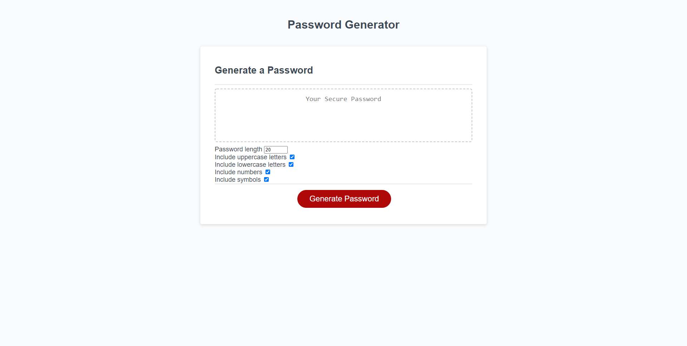

# Password Generator Starter Code
Allows the user to generate a random password based on specifications they set:  
-Length  
-lower case  
-UPPER case  
-Numbers  
-Symbols  
  
##Screanshot of deployed webpsite  
  

##Live website: [https://github.com/TPino92/password-generator]
##GitHub Repo: [https://github.com/TPino92/password-generator]  
  
###Helpful benifactors  
Traversy Media [https://www.youtube.com/channel/UC29ju8bIPH5as8OGnQzwJyA]
Florin Pop: [https://www.florin-pop.com/]